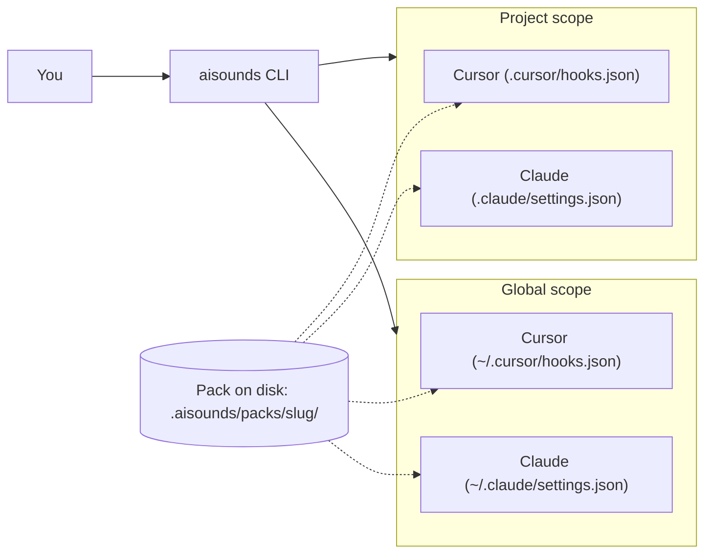

import { CopyPageButton } from '@/components/docs/copy-page-button'

export const metadata = {
  title: 'Tools and scopes · AI Sounds Docs',
  description:
    'Understand how aisounds installs work across the two orthogonal dimensions: the tool (Cursor, Claude Code, …) and the scope (project vs global).',
}

<div className="not-prose mb-6 flex justify-end">
  <CopyPageButton source="/docs-md/concepts.md" />
</div>

# Concepts: tools and scopes

When you install an `aisounds` pack you are choosing **two independent things at once**:

1. **Which tool** the sounds are wired into (Cursor, Claude Code, …).
2. **Which scope** they apply to (this project, or your whole user account).

These two dimensions are **orthogonal**: any combination is valid. Confusing them is the most common source of "why isn't it playing?" questions, so let's break them down.

## 1. Tool dimension

A **tool** is the AI coding app you want to react to events with sound. Each tool has its own:

- **Hook config file** the CLI writes into.
- **Set of supported events** (the names differ between tools).
- **Execution model** for hooks.

Same pack, same audio files under `.aisounds/packs/<slug>/`, but each tool gets its own "plug" in its native config format.

| Tool | Where we write | Supported events (sample) |
|------|----------------|----------------------------|
| **Cursor** | `.cursor/hooks.json` + scripts in `.cursor/hooks/aisounds/` | `stop`, `sessionStart`, `beforeSubmitPrompt`, `preToolUse` |
| **Claude Code** | `.claude/settings.json` (`hooks` block) | `Stop`, `StopFailure`, `SessionStart`, `SessionEnd`, `UserPromptSubmit`, `PermissionRequest`, `Notification` |

You select the tool with `--tool` on `install`:

```bash
npx @aisounds/cli@latest install retro-beeps --tool cursor
npx @aisounds/cli@latest install retro-beeps --tool claude-code
```

You can run both commands to install the same pack in **both** tools. They don't conflict — they write to different config files.

## 2. Scope dimension

A **scope** is where the install applies. There are two:

| Scope | Flag | Where state and hooks live |
|--------|-------|----------------------------|
| **Project** (default) | _none_ or `--project <path>` | Inside your project: `.aisounds/installed.json`, `.cursor/hooks.json`, `.claude/settings.json` |
| **Global** | `--global` | In your user folder: `~/.aisounds/installed.json`, `~/.claude/settings.json`, `~/.cursor/hooks.json` |

- **Project scope** is the default and is what you want for "sounds only when I work in this repo".
- **Global scope** applies to every workspace your tool opens, unless overridden by a project-level config.

The active pack and the list of installed packs are tracked **per scope**. Each scope has its own `installed.json`.

## 3. How they combine

The two dimensions form a 2×2 matrix. Every install command picks **one cell**:

|              | **Project**                                     | **Global**                                       |
|--------------|--------------------------------------------------|--------------------------------------------------|
| **Cursor**   | `install <slug> --tool cursor`                  | `install <slug> --tool cursor --global`         |
| **Claude**   | `install <slug> --tool claude-code`             | `install <slug> --tool claude-code --global`    |

You can fill multiple cells at once. For example:

```bash
# Pack A in this project, Cursor + Claude
npx @aisounds/cli@latest install pack-a --tool cursor
npx @aisounds/cli@latest install pack-a --tool claude-code

# Pack B globally for Claude only
npx @aisounds/cli@latest install pack-b --tool claude-code --global
```

`activate` works **per scope**: activating in project does not change global, and vice versa.

```bash
npx @aisounds/cli@latest activate pack-a              # affects project state only
npx @aisounds/cli@latest activate pack-b --global     # affects global state only
```

## 4. Mental model



Read this as: **the pack files live once in disk; each tool/scope cell points at them through its own hook config**.

## 5. AISE: the canonical event vocabulary

Each pack maps audio files to events from the **AISE** (AI Sound Events) standard, e.g. `task_complete`, `task_failed`, `prompt_sent`. Tools translate AISE events into their own hook names through internal mappings.

This means a pack author writes once against AISE, and the same pack works in any supported tool. See the [AISE events reference](/docs/events) for the full list and how each event maps per tool.

## 6. Quick troubleshooting

- **Pack installed but no sound?** Check that you ran `activate` for the right scope, and restart the tool.
- **Two packs interfering?** Activating a pack in a scope replaces the previous active one in that same scope. They don't stack.
- **Wrong scope?** Run `aisounds list` (project) or `aisounds list --global` (global) to see what is installed where.
- **Want to silence one event?** Use `aisounds sounds <slug>` to enable / disable specific events without uninstalling.

## See also

- [Getting started](/docs/getting-started)
- [CLI reference](/docs/cli)
- [AISE events reference](/docs/events)
