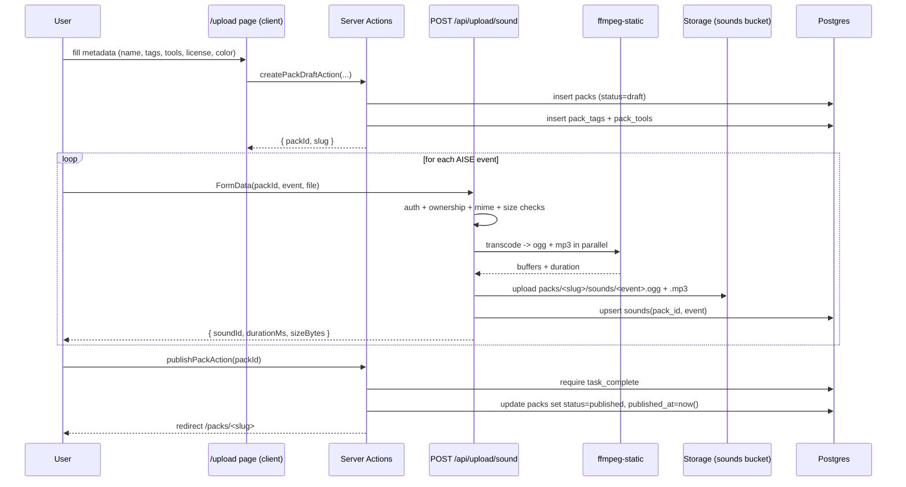

# Upload flow

The `/upload` wizard is a three-step client component powered by Server
Actions and a Node-runtime API route. It produces the same DB + Storage
layout that the CLI will later read when installing packs.

## Sequence

## Server-side validation

`POST /api/upload/sound` runs on the Node runtime (set explicitly via
`export const runtime = 'nodejs'`) because `fluent-ffmpeg` + `ffmpeg-static`
need access to the binary.

It enforces, in order:

1. **Auth** — must be a logged-in Supabase user.
2. **Ownership** — the pack belongs to the caller and is still `draft`.
3. **MIME + size** — accepted types come from `FILE_RULES.accepted_mime_types`
   and the file must be ≤ 1 MB.
4. **Transcoding** — the source is written to a per-request tmp dir and
   ffmpeg produces two outputs in parallel:
   - `out.ogg` (libvorbis, 96 kbps)
   - `out.mp3` (libmp3lame, 128 kbps)
5. **Duration** — captured from fluent-ffmpeg's `codecData` event. We enforce
   both the global 10 s cap and the per-event cap in `EVENT_SPEC[event].maxMs`.
6. **Pack quota** — the sum of existing sound sizes + new buffer cannot
   exceed `FILE_RULES.max_pack_total_bytes` (5 MB).
7. **Storage write** — uploads go to
   `sounds/packs/<slug>/sounds/<event>.{ogg,mp3}` using the service role
   (bypassing RLS, safe because all checks above already ran).
8. **DB upsert** — a single `sounds` row per `(pack_id, event)` using
   `onConflict: 'pack_id,event'`.

## Troubleshooting ffmpeg

- **`spawn ENOENT` / binary missing** — usually means `pnpm install` did not
  run the `ffmpeg-static` postinstall script. The root `package.json` has
  `pnpm.onlyBuiltDependencies` listing it; if it fails, run
  `pnpm rebuild -r ffmpeg-static`.
- **Invalid audio format** — the API returns HTTP 422 with a generic "Could
  not process audio" message. Inspect the Next.js terminal logs for the
  underlying ffmpeg stderr output.
- **Duration shows `0ms`** — fluent-ffmpeg's `codecData` event was not fired,
  usually because the file is not valid audio. The API will respond with
  422 in that case.
- **Uploads succeed but `/packs/<slug>` 404s** — the pack is still a draft.
  Drafts only show up to their owner and only after `publishPackAction` is
  called.

## Local testing checklist

1. Sign in with GitHub.
2. Go to `/upload` and fill the metadata form. Click _Create draft_.
3. Upload at least `task_complete` (the required event).
   The row shows a waveform player once the upload succeeds. You can remove
   an uploaded audio from the wizard and choose another file before publish.
4. Hit _Review_, then _Publish pack_. You should land on `/packs/<slug>`.
5. Visit `/profile/<your-username>` to see the pack in your grid.
6. Go back to `/packs` — the new pack appears in the trending list (with a
   small freshness boost from the RPC).
